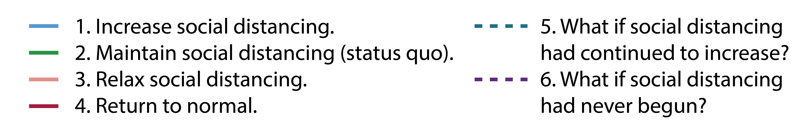
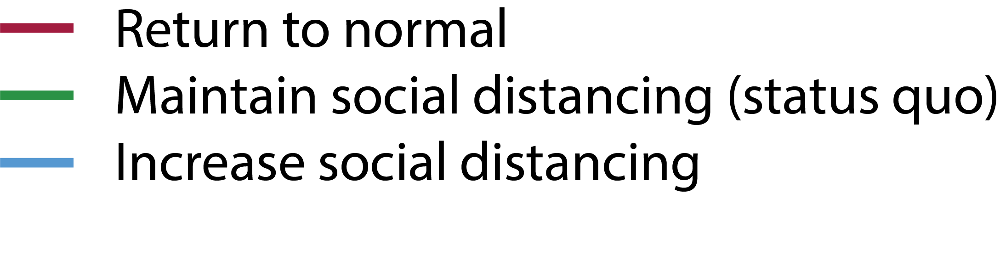

```{r setup, include=FALSE}
knitr::opts_chunk$set(echo = FALSE)
library(here)
library(tidyverse)
library(plotly)
source("code/plotting/plot-scenarios.R")
```

# {.tabset .tabset-fade}

## Overview

The epidemiology of COVID-19 is poorly understood.
To better understand the potential range of epidemic outcomes in the state of Georgia, we developed a model based on the accumulation of knowledge from various locations and calibrated it to regionally specific conditions in Georgia as well as observations of the number of reported cases, hospitalizations, and deaths.

This model supersedes prior stochastic models for Georgia published on this website.

### Data

```{r read-data}
filenames <- list.files(path = here("output/"), pattern = "Georgia_COV")
filename <- tail(sort(filenames[grep("*mif.rds", filenames)]), 1)
fullpath <- paste0("output/", filename)
data <- readRDS(here(fullpath))$pomp_data %>%
  dplyr::select(-time) %>%
  rename("new_cases" = cases,
         "new_hospitalizations" = hosps,
         "new_fatalities" = deaths) %>%
  mutate()
```

At the time of this report, Georgia is reporting `r format(sum(data$new_cases, na.rm = TRUE), big.mark=",")` cases, `r format(sum(data$new_hospitalizations, na.rm = TRUE), big.mark=",")` hospitalizations,  and `r format(sum(data$new_fatalities, na.rm = TRUE), big.mark=",")` deaths.
These data are from <a href="https://covidtracking.com/" target="_blank">covidtracking.com</a>.
Grey bars represent reported data and the black line represents the fit of our model to observed data.

```{r fits, warning=FALSE, message=FALSE, out.height='250px'}
plot_fits()
```

<!-- <iframe width='100%' height='400px' style='border:none; margin: 0; padding: 0;' src='output/figures/covidtracker-figures/fits-to-data.html'></iframe> -->

<!-- ```{r data-plot, warning=FALSE, message=FALSE, fig.height=3, fig.width=8.5} -->
<!-- datlong <- data %>% -->
<!--   rename("Acases" = new_cases, -->
<!--          "Bhosps" = new_hospitalizations, -->
<!--          "Cdeaths" = new_fatalities) %>% -->
<!--   gather("variable", "value", -Date) -->

<!-- variable_names <- c( -->
<!--   "Acases" = 'New cases', -->
<!--   "Bhosps" ='New hospitalizations', -->
<!--   "Cdeaths" = 'New deaths' -->
<!-- ) -->

<!-- g <- ggplot(datlong, aes(x = Date, y = value)) + -->
<!--   geom_col() + -->
<!--   facet_wrap(~variable, ncol = 3, scales = "free_y", -->
<!--              labeller = labeller(variable = variable_names)) + -->
<!--   ylab("Number of persons") + -->
<!--   scale_y_continuous(labels = scales::comma)+ -->
<!--   theme_minimal() -->
<!-- g %>% plotly::ggplotly() -->
<!-- ``` -->

### Model

To date, the primary intervention has been the adoption of social distancing behaviors and improved hygiene.
We measure social distancing using aggregated, anonymized locations recorded by location-based mobile phone apps.
We summarize the effectiveness of social distancing behaviors as the average deviation from baseline, a statistic ranging from 0% (complete cessation of movements) to 100% (no difference from baseline).

We explore a range of social distancing scenarios in Georgia going forward from the present, ranging from increasing social distancing to completely ending social distancing. For each scenario, we use our model to project the likely outcomes for each scenario. We run our model one thousand times for each scenario. The plot below summarizes the social distancing scenarios and the projected cumulative number of cases for each scenario, with a range of possible outcomes for each.

<!--  -->

{ width=350px }


```{r summaryfig, warning=FALSE, message=FALSE, out.height = '400px'}
plot_summaryfig()
```

<!-- <iframe width='100%' height='600px' style='border:none; margin: 0; padding: 0;' src='output/figures/covidtracker-figures/landing-page-fig.html'></iframe> -->

<!-- ```{r unacast, message=FALSE, warning=FALSE, fig.width=5, fig.height=3} -->
<!-- covarfile <- list.files(here("output/"), pattern = ) -->
<!-- covar <- readRDS(here("data/rel-beta-change-covar.rds")) -->
<!-- start_date <- as.Date("2020-03-01") -->
<!-- dates <- seq(start_date, start_date + nrow(covar) - 1, by = 1) -->
<!-- date_df <- data.frame(Date = dates, time = 1:nrow(covar)) -->
<!-- covar <- covar %>% -->
<!--   left_join(date_df, by = "time") -->

<!-- g <- ggplot(covar, aes(x = Date, y = rel_beta_change)) + -->
<!--   geom_line() + -->
<!--   ylab("Social distancing\n(human movement as % of baseline)") + -->
<!--   theme_minimal() + -->
<!--   scale_y_continuous(limits=c(0,1), labels = scales::percent) + -->
<!--   geom_point(alpha = 0,  -->
<!--              aes(text=sprintf("Date: %s<br>Movement: %s",  -->
<!--                               Date,  -->
<!--                               scales::percent(rel_beta_change, accuracy = 0.01))))  # tooltip -->
<!-- g %>% plotly::ggplotly( -->
<!--   tooltip = c("text") -->
<!-- ) -->
<!-- ``` -->


<!-- ```{r fits} -->
<!-- knitr::include_graphics(here("output/figures/covidtracker-figures/",'fits-to-data.png')) -->
<!-- ``` -->


## Scenarios

Here we explore a range of scenarios for transmission in Georgia.
All simulations start on 1 March.
The model is fit to data on reported cases, hospitalizations, and deaths to `r format(Sys.time(), '%B %d, %Y')` and propagated six weeks into the future.

Key dates for the control COVID-19 in Georgia include:

* March 14, 2020: Declaration of a public health state of emergency in Georgia
* March 23, 2020: Executive order limiting large gatherings statewide and ordering "shelter in place"
* April 20, 2020: Executive order moving certain businesses to minimum operations

In what follows we consider three social distancing scenarios based on what has already happened to date:

1. **Increase social distancing.** Increasing social distancing reduces human movements from the current level to 30% of normal, which is the reduction observed in New York City that enabled transmission to decline there.
2. **Maintain social distancing (status quo).** Maintaining social distancing at the level last observed.
3. **Return to normal.** Ending social distancing increases human movements from the current level to 100% of normal. 

***

### Cumulative infections over time

The following plot shows the estimated total number of infections for the three scenarios. Shaded regions represent the area within which 95% of the model simulations fall.

<!-- #### Natural scale -->

```{r infections}
knitr::include_graphics(here("output/figures/covidtracker-figures",'infections-trajs-nat.png'))
```

<!-- #### Log scale -->

<!-- ```{r infectionsl} -->
<!-- knitr::include_graphics(here("output/figures/covidtracker-figures",'infections-trajs-log.png')) -->
<!-- ``` -->

### Cumulative cases, hospitalizations and deaths (6 week projection)

The following plot shows the range (95% of simulations fall in this range) of projected cumulative number of recorded cases, hospitalizations, and deaths six weeks from today for each scenario.
The white dots indicate the median projection across simulations. 
Note that all three measures of epidemic size are believed to be under-reported, so the true epidemic size is likely to be considerably larger (e.g., the true number of cumulative infections is likely to be 10 to 12 times larger than the numbers reported in these figures).

<!-- ### {.tabset .tabset-fade .tabset-pills} -->

<!-- #### Natural scale -->

```{r cumsums}
knitr::include_graphics(here("output/figures/covidtracker-figures",'cumulative-forecasts.png'))
```

<!-- #### Log scale -->

<!-- ```{r cumsumsl} -->
<!-- knitr::include_graphics(here("output/figures/covidtracker-figures",'cumulative-forecasts-log.png')) -->
<!-- ``` -->

<!-- ### {.tabset .tabset-fade .tabset-pills} -->

### Daily cases, hospitalizations and deaths over time (mean of simulations)

<!-- #### Natural scale -->

```{r allnl}
knitr::include_graphics(here("output/figures/covidtracker-figures",'all-projs-line-nat.png'))
```

<!-- #### Log scale -->

<!-- ```{r allll} -->
<!-- knitr::include_graphics(here("output/figures/covidtracker-figures",'all-projs-line-log.png')) -->
<!-- ``` -->


<!-- ```{r allnr, eval = FALSE} -->
<!-- knitr::include_graphics(here("output/figures",'all-projs-ribbon-nat.png')) -->
<!-- ``` -->

<!-- ```{r alllr, eval = FALSE} -->
<!-- knitr::include_graphics(here("output/figures",'all-projs-ribbon-log.png')) -->
<!-- ``` -->

***

### Daily cases and deaths over time (data, model fit, projections)

The following plots show the observed and projected daily number of recorded cases and deaths for the three scenarios. Dashed line represents the observed data. The green line is our model's fit to the observed data, and the purple line is the mean projection. Shaded regions represent the area within which 95% of the model simulations fall.

<!-- ### {.tabset .tabset-fade .tabset-pills} -->
<!-- #### Natural scale -->

```{r cases}
knitr::include_graphics(here("output/figures/covidtracker-figures",'cases-trajs-nat.png'))
```

<!-- #### Log scale -->

<!-- ```{r casesl} -->
<!-- knitr::include_graphics(here("output/figures/covidtracker-figures",'cases-trajs-log.png')) -->
<!-- ``` -->

<!-- ### {.tabset .tabset-fade .tabset-pills} -->

<!-- *** -->

<!-- #### Natural scale -->

<!-- ```{r hosps} -->
<!-- knitr::include_graphics(here("output/figures/covidtracker-figures",'hosps-trajs-nat.png')) -->
<!-- ``` -->

<!-- #### Log scale -->

<!-- ```{r hospsl} -->
<!-- knitr::include_graphics(here("output/figures/covidtracker-figures",'hosps-trajs-log.png')) -->
<!-- ``` -->

<!-- ### {.tabset .tabset-fade .tabset-pills} -->

<!-- *** -->

<!-- #### Natural scale -->

```{r deaths}
knitr::include_graphics(here("output/figures/covidtracker-figures",'deaths-trajs-nat.png'))
```

<!-- #### Log scale -->

<!-- ```{r deathsl} -->
<!-- knitr::include_graphics(here("output/figures/covidtracker-figures",'deaths-trajs-log.png')) -->
<!-- ``` -->

## Model details

Key features of this model include:

* Stochastic transmission process. Stochastic models are models with a realistic level of random variation. Stochastic models are essential for proper modeling of systems that start with a small number of infections.
* Realistic interval distributions for presymptomatic and symptomatic periods.
* Transmission is allowed at different rates for asymptomatic, presymptomatic, and symptomatic individuals.[^1]
* Time varying rates of case detection, isolation, and case notification.
* Realistic intervention scenarios.

This model comprises susceptible, pre-symptomatic, asymptomatic, symptomatic, diagnosed, hospitalized, deceased, and recovered persons. 
The following compartments are included:  

* $\boldsymbol{S}$ - Uninfected and *susceptible* individuals. Susceptible individuals can become infected by individuals in the $E$, $I_a$, $I_{su}$, $I_{sd}$, $C$, and $H$ stages. Rates of transmission from these stages can be adjusted individually.
* $\boldsymbol{E}$ - Individuals who have been *exposed*, and so are infected, but do not yet show symptoms. Those individuals can be infectious. At the end of the $E$ stage, a fraction moves into the $I_a$ stage, another fraction moves into the $I_{su}$ stage, and the remainder into the $I_{sd}$ stage.
* $\boldsymbol{I_a}$ - Individuals who are infected and *asymptomatic*. Those individuals are likely infectious, but the model allows to adjust this.
* $\boldsymbol{I_{su}}$ - Individuals who are infected and *symptomatic*, but are *undetected*. Those individuals are likely infectious. Individuals in this compartment never get diagnosed, and are assumed to recover.
* $\boldsymbol{I_{sd}}$ - Individuals who are infected and *symptomatic*, and are *detected*. Those individuals are likely infectious. Individuals in this compartment will get diagnosed and move to $C$.
* $\boldsymbol{C}$ - Individuals who have been diagnosed as *cases*. Those individuals are likely isolated and not infectious, but the model allows to adjust this. A fraction of individuals in the $C$ stage will naturally recover, without the need for hospitalization. The remainder moves into the $H$ stage.
* $\boldsymbol{H}$ - Individuals who have been *hospitalized*. Those individuals are likely isolated and not infectious, but the model allows to adjust this. A fraction of individuals in the $H$ stage will recover, the remainder will die.
* $\boldsymbol{R}$ - *Recovered/removed* individuals. Those individuals have recovered and are immune. 
* $\boldsymbol{D}$ - Individuals who *died* from the infection. 

To allow more realistic distributions of movement through compartments, several of these compartments are internally split into multiple stages using the *linear chain trick*.[^2]

* $\boldsymbol{E}$ - 4 compartments
* $\boldsymbol{I_a}$ - 4 compartments 
* $\boldsymbol{I_{su}}$ - 4 compartments
* $\boldsymbol{I_{sd}}$ - 4 compartments
* $\boldsymbol{C}$ - 4 compartments
* $\boldsymbol{H}$ - 4 compartments

The flow diagram for this model shown below.

```{r pomp-model}
knitr::include_graphics(here("docs",'pomp-model.png'))
```

### Interventions

The following interventions are implemented:

* Social distancing is assumed to reduce all transmission rates by some factor. This is provided as a covariate based on mobility data.
* Improving detection, which is assumed to increase sigmoidally up to a maximum value.
* Improving detection, which is assumed to increase the fraction of symptomatic individuals that move into the $I_{sd}$ compartment and will eventually be diagnosed. It is assumed to increase sigmoidally up to a maximum value.

### Parameterization

This model was initially parameterized using clinical outcome reports from the epidemic in Hubei province, China and further calibrated with information about COVID-19 elsewhere in China and the United States.

The model is created for a population of 10.6 million people, approximately the population size of Georgia, and simulated forward from March 1.
Transmissibility of the virus is assumed to be proportional to the level of human movement.

Key parameters estimated using maximum likelihood by iterated filtering (MIF)[^3] include baseline transmissibility ($\beta_0$), maximum ascertainment (i.e. maximum fraction of cases detected), fraction of known cases that are hospitalized, fatality rate among hospitalized cases, and observation errors. 
Auxiliary parameters estimated using MIF include the intensity of the parameter random walk and dispersion parameters for observables.

For more details, see the <a href='https://github.com/CEIDatUGA/COVID-GA-model' target='_blank'>public GitHub repository</a>

<small>**Disclaimer:** The COVID-19 epidemic is changing rapidly, and information that was used in the construction of this model may be incomplete or contain errors.
Accordingly, these results are preliminary, provisional, and subject to change.
These results have not been peer-reviewed, but have been prepared to a professional standard with the intention of providing useful interpretation of a rapidly developing event.</small>


[^1]:[Rong et al. 2020](https://wwwnc.cdc.gov/eid/article/26/5/20-0198_article?deliveryName=DM20712), [Du et al. 2020](https://www.medrxiv.org/content/10.1101/2020.02.19.20025452v3)

[^2]:[Hurtado & Kirosingh 2019](https://link.springer.com/article/10.1007/s00285-019-01412-w)

[^3]:[Ionides et al. 2006](https://www.pnas.org/content/103/49/18438)


